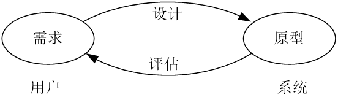
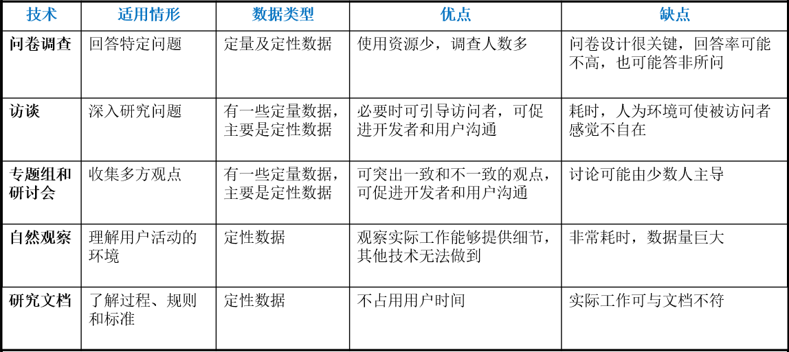
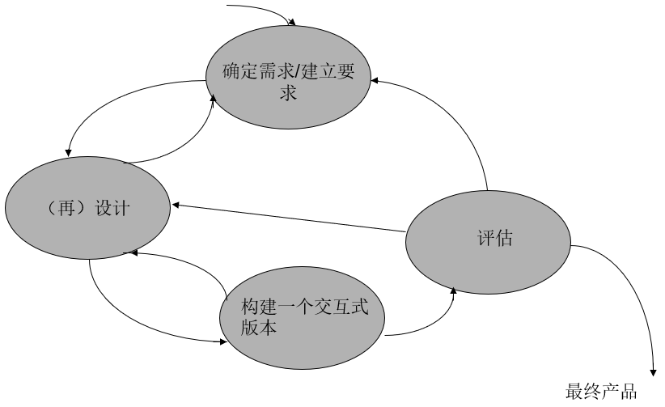
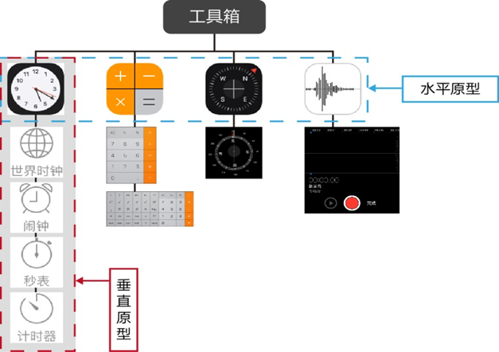
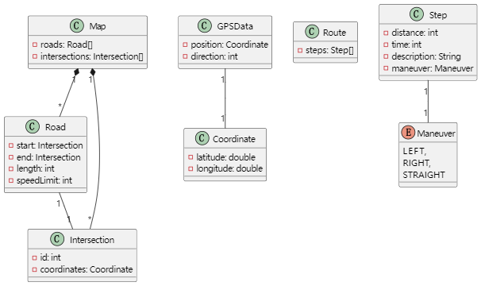

【1.24】交互设计过程的三个主要特征
1. **用户**在整个设计过程中的**主动参与**（用户主动参与）
2. 特殊的**可用性和用户体验目标**应在项目开始前识别、明确建档，并获得一致性
3. 上述的设计活动需要进行**迭代**

【5.22】什么是代理
- **人类代理**在物理世界中 代表着**客户**的利益
- **软件代理**在虚拟世界中 代表着**用户**的利益

从**技术**的角度，代理可以分为两类
- **反应代理**：只是简单地对用户的活动做出反应
- **智能代理**：通过学习用户的活动做出智能行为

【3.23】长期记忆中的信息检索具有两种类型
- **回忆**：所需信息完全从记忆中再生，如闭卷考试
- **识别**：环境中呈现的信息提示该信息是以前知道的，如开卷考试
- 人类识别事物的能力远强于回忆事物
- 这两个过程也不是独立的：回忆可通过环境中的信息提示来辅助，如菜单栏的分类提示帮助回忆相应的菜单选项

【6.32】需要选择的产品特征（或属性）可概括为两类
- **外部特征**：对用户而言，可见及可度量的属性
- **内部特征**：对用户通常是不可见或不可度量的属性

【7.49】基本用例的描述包括三个部分
- 用例名：概括用户目的或意图的描述
- 用户意图：想要完成的阶段性工作
- 系统响应：系统完成的工作或责任

【1.26】可用性指易于使用并令人满意，具体可分为
- A、有效使用（effective to use）
- B、高效使用（efficient to use）
- C、安全使用（safe to use）
- D、良好的实用性（have good utility）
- E、易于学习（easy to use）
- F、易于记忆如何使用（easy to remember how to use）

【6.36】在开发早期，应就质量问题在参与者之间达成一致
- 包括**可用性目标**、**度量标准和方法**、**允许误差**等
  - A、可用性目标
  - B、度量标准和反馈方法
  - C、允许误差
  - ~~D、满意度目标~~ （在开发早期没有办法确定满意度目标）

【4.39】言语动作的类型：可划分为以下5类
  - **断言**：断定某事成立（如我认为他们是合法夫妻）
  - **承诺**：答应做某事（如我去复印这个文档）
  - **声明**：说明某事与事实相符（如我宣布你们为合法夫妻）
  - **指示**：祈使对方做某事（如您能复印这个文档吗？）
  - **表达**：描述当前的心理状态（如这事做得不错）

【7.34】不同的任务描述方法：情节、用例、基本用例
- A、情节（场景）
- B、用例
- ~~C、具体用例~~
- D、基本用例

【6.39】有关产品开发的生命周期模型描述正确的：
- A、他是对**实际或建议的产品开发过程的抽象描述**
- B、描述了产品开发过程中若干活动和活动之间的关系
- ~~C、瀑布模型适用于需求变化的情况~~
- D、用于产品开发的质量保证和管理控制

【1.27】高效使用：**熟练用户的使用效率**，即完成的任务和所使用的资源（时间、步骤等）之间的比率

> 高效性是指~~初学者~~（用户）使用产品的效率

【7.57】任务分析技术有助于研究现有系统和当前的工作实践

【7.57】用户任务描述（情节、用例和基本用例）能帮助用户明确说明实际工作，也可用于展望新产品的使用
- 在概念设计中，情节（user story）用于描述未来的建议或想象的交互情形

【7.57】建立正确的需求对交互式产品的成功至关重要

【7.50】基本用例建模：对用户动作序列抽象，导出其意图。交互设计过程中，
- 概念设计阶段：情节：描述未来使用情况，辅助说明设计
- 建立高保真原型时：具体用例：指定系统功能需求

> 基本用例（用例名、用户意图、影响）指定了~~交互方式（会话、探索、指令、交互）和交互泛型等~~

交互设计的四项基本原则、活动和三个特征分别是什么？
- 交互设计原则上包括4项活动【1.22】
  - 识别用户需要并建立需求
  - 开发满足需求的候选设计方案
  - 构建用于交流和评估的交互式原型（prototype）
  - 评估整个过程的设计结果
- 交互设计原则包括哪几项活动并说明他们之间的关系：
  - 这些活动通常相互之间具有联系，且本身是**迭代过程**
    - 
- 交互设计过程的三个主要特征【1.24】
  - 用户在整个设计过程中的主动参与
  - 特殊的可用性和用户体验目标应在项目开始前识别、明确建档，并获得一致性
  - 上述的设计活动需要进行迭代

【1.36】基本的设计原理包括**可视性**、**反馈**、**限制**、**映射**、**一致性**和**启发性**等。（并分别举实例说明其应用的优势或好处：
- 可视性：系统呈现下一步可执行操作，以及系统状态改变
  - 例如：安装软件时，系统提示用户下一步操作。
- 反馈：操作结果（系统状态改变）的可视性
  - 例如：键盘、鼠标的触觉反馈，文件操作的视觉反馈等
- 限制：即对用户在特定时刻可执行操作的限制（限制分为三个类型：物理、逻辑和文化限制）
  - 例如：将在当前系统状态下不可执行的菜单命令置为灰色
- 映射：控制操作和操作效果之间的对应关系
  - 例如：键盘上箭头键和屏幕上光标移动的关系
- 启示性（affordance）：事物可能通过其形状或其他属性建议可以对他们作什么
  - 点击图标是因为用户了解这是图标给予的启示

【1.44】Nielsen提出了10个主要的可用性原理
1. 系统状态的可视性：适时提供适当反馈，便于用户了解系统的状态
2. 系统应与真实世界相符合：使用用户的语言，而非面向系统的概念和术语
3. 用户的控制和自主权：提供醒目的出口，便于用户退出异常状况
4. 一致性和标准化：避免用户无法确定不同的词汇、情景、动作是否表示相同的含义
5. 帮助用户识别、诊断和修复错误：使用简明语言，描述问题的性质并提供解决的方法
6. 预防出错：应尽可能地避免错误的发生
7. 依赖识别而非记忆：使得对象、动作和选项清晰可见
8. 使用的灵活性和有效性：为熟练用户提供快捷键
9. 最小化设计：避免使用无关或极少使用的信息
10. 帮助及文档：提供易于检索、便于学习的帮助文档

【8.55】Shneiderman的八个黄金原理
- 保持一致性
- 允许熟练用户使用快捷键
- 提供明确的反馈
- 设计对话，提示任务已完成
- 提供错误预防和纠错功能
- 应便于用户撤销某个操作
- 用户掌握控制权
- 减轻记忆负担

【4.5】通信（communication）是个体之间的信息交换过程
- 按照所交换信息的性质，通信可以是
  - **交流思想、传达消息、联络感情、下达命令**等
- 按照个体之间的**协调方式**，通信可以采用
  - **同步方式**：交流思想、联络感情
  - **异步方式**：传达消息、下达命令
- 按照信息的**编码方式**，通信可以利用
  - **言语**：口述
  - **非言语**：手势、表情、语调、其他肢体语言
- 按照个体之间的**联接方式**，通信可以通过
  - **面对面、信件、电话、电报**等

【6.18】交互设计应该考虑哪几类用户的利益：
- 甲方
  - 主要方：即**最终用户**
  - 第二方：**间接使用**系统的人员
    - 如项目经理未直接使用，但通过用户接受系统产生的报告
  - 第三方：他们不属于以上两类，但**受到**系统成败的**影响**
- 乙方
  - 提供方：包含在系统**设计**、**开发**和**维护**中的人员

【7.23】数据收集的方法和技术有哪些？分别有什么特点和优缺点？

【6.41】作图并描述交互设计的简单生命周期的基本活动特征：

【8.29】概念建模的三个方面：
- **交互方式**对用户的活动提供支持
- **界面隐喻**使用户易于理解产品的使用
- **交互范型**为具体化概念模型提供了指导

【2.22】基于活动的概念模型最常用的人机交互方式有：
- **指令型**（instructing）用户指示系统做某事 （如点击按钮）
- **会话型**（conversing）用户与系统的实时信息交换 （一问一答）
- **操作型**（manipulating）用户直接操作虚拟空间中的对象 （如拖拽）
- **探索型**（exploring）用户穿越虚拟（或物理） 空间（如游戏）

【3.6】人类的日常活动可以看成由两部分构成
- **生理活动**：发生在**肢体上**的任何行为或过程
- **心理活动**：发生在**头脑中**的任何行为或过程

【6.23】**个人的才智**和**创造力**的确对创新设计做出了重要贡献

【7.25】选择数据收集技术基于两个因素：**技术的特征**和**需研究的任务**

【8.24】按表达产品功能完善程度原型可以分为：
- **水平原型**（Horizontal prototype）：提供了较多的**功能**，但缺乏细节
- **垂直原型**（Vertical prototype）：提供了较多的**细节**，但仅提供少许功能

【3.12】与交互设计紧密相关的认知过程有：**注意、感知、识别和记忆**

【2.24】传统的、但仍广泛在各种设备和系统上使用的交互类：指令型
哪一个是传统的但仍包含在在各种设备和系统上使用的交互类型：
- A、指令（√）
- B、操作和引导
- C、会话
- D、探索和浏览

思维模型的建立@性包括？
- A、请教他人
- B、自己使用系统（√）
- C、学习系统使用材料
- D、学习系统的开发文档

【3.8】按照思维方式认知可以划分为几种模型并具体解释：
Norman按照思维方式将认知划分为两种模式
- 经验式认知（experiential cognition mode）
  - 可以有效并毫不费力感知到周围发生的事件，并对其作出反应
  - 表示了一种熟练的行为模式，依赖于过程式知识和训练
- 思考式认知（reflective cognition mode）
  - 比较、对比、思考和决策时的思维方式
  - 表示了创新思想的来源，依赖于说明式知识

> - Ivan Sutherland的**画板**系统将计算引入**图形**时代（图灵奖）
> - Douglas Engelbart的**鼠标**将计算引入**窗口**时代（图灵奖）

【6.32】简述设计决策（在提出的设计方案中做出选择称为设计决策）的两种途径：
- 决策的一种途径是基于**用户（及参与者）的评估**
  - 产品是为他们所设计，选择需要按照他们的体验和建议
  - 为了让用户参与评估，须使用他们能理解的方式描述设计
- 选择的另一个途径是采用**客观的质量度量**
  - 用户评估方案的可用性通常基于的是用户的主观体验
  - 另一种可用性评估是客观度量用户与产品交互的体验

人机交互中不同需求类型包括几种？
【8.16】交互式产品的需求分类
- **功能需求**：系统应提供的服务，描述应简明、无二义
- **数据需求**：系统所需处理的数据
  - 数据类型、可变性、大小/数量、持久性、准确性和取值
- **环境需求**：产品的使用环境，包括4个方面的因素
  - 物理环境：涉及到工作环境本身及交互方式的设计
  - 社会环境：涉及到对人员之间协作、协调和通信的支持
  - 组织环境：涉及到对用户工作的支持程度
  - 技术环境：涉及到对系统开发的限制
- **用户需求**：目标用户群的特征，通常表示为用户属性集
  - 包括能力、知识、背景、偏好等
  - 不同的用户类型对可用性具有不同的需要
- **可用性需求**：需达到的可用性目标和度量标准
  - 按照可用性工程，可用性规约需要明确指定

【7.34】不同的任务描述方法有几种并具体阐述：
- 情节【7.37】
  - 一种非形式的叙事性描述（又称用户故事(User Story)）
  - 内容：描述具体行为、活动或任务
  - 特点：用户语言描述
  - 形式：文字、草图、录像和录音剪辑等
  - 描述当前情节：帮助理解使用上下文，提取与用户需要和需求相关的信息
  - 描述未来情节：帮助探索和建立需求
- 用例【7.41】
  - 描述用户和系统的交互，对情节进行抽象
  - 定义：按照UML，用例是一个系统执行的动作序列（包括替换序列）集合，对行为者产生可观察的结果
- 基本用例【7.48】
  - 在一个抽象层次上指定用户和系统的交互
    - 描述用户想要做什么，以及系统响应
    - 避免不成熟设计的相关技术假定
    - 允许设计者考虑不同的交互设计方案

为什么要进行人机交互？
1. 算法的局限性
2. 交互式计算
3. 交互式系统

进行人机交互的主要原因？用户需要，客观原因，算法的局限性性

【0.16】人机交互的发展主要经历了三个阶段的特点、优缺点。
1. 命令行界面
   - 早期计算机系统使用的一种简单而高效的界面。用户通过输入特定的命令来与计算机进行交互。
   - 优点：直接、快速，适于专家用户，用户可以直接输入指令，而无需使用鼠标或其他方式进行操作。
   - 缺点：难于学习、使用；不同系统，命令不同
2. 图形用户界面（GUI）
   - WIMP（窗口、图标、菜单、指示器）界面风格，也经常被简单称为“窗口系统”（隐喻）
   - 优点：易于上手，用户不需要记住各种命令和语法规则，只需要用鼠标点击即可完成操作。
   - 缺点：GUI界面通常需要消耗更多的系统资源，会导致系统变慢。
3. 自然用户界面（NUI）
   - 随着虚拟现实、移动计算、无处不在计算等技术的飞速发展，自然和谐的人机交互方式得到了一定的发展。基于语音、手写体、姿势、视线跟踪、表情等输入手段的多通道交互是其主要特点，其目的是使人能以声音、动作、表情等自然方式进行交互操作。
   - 优点：更加人性化和便捷，用户可以直接用自己熟悉的方式与计算机交互，无需学习任何新的命令和规则。
   - 缺点：NUI的技术还没有完全成熟，存在一定的误识别和误操作问题。

外部表示的好处？
- A、外部化以减轻记忆负担
- B、减少计算负载
- C、标注
- D、认知跟踪

界面原型主要是来测试物理设计。

【6.20】可能需要和技术之间永远是一个chicken-and-egg问题
- 有观点认为人类需要是科技发展的动力
- 也有观点认为科技发展推动了人类的需要

【6.3】基础研究、应用研究和实践研究之间的关系可以表示为：（画图）
- 基础研究和应用科学为描述这些问题提供了模型、方法等
- 实践领域也为解决这些问题提供了经验和技术

给出一个行车导航软件，完成行车路径的选择，以及查询功能。
1. 你要选择哪种不同的数据收集技术并说明原因和理由
2. 编写一个未来场景，说明用户如何使用该产品来进行导航。
3. 根据导航情况，分析并描述该产品的各类需求。以及他有几种类型的用户。
4. 设计相应的概念模型，给出相应设计决策的理由并用线框图表示@设计的@，及其数据结构。包括层次任务分析。

数据收集技术：为了完成行车路径的选择和查询功能，可以使用以下两种数据收集技术：
1. GPS定位技术：通过手机或车载设备内置的GPS芯片，实时获取用户当前位置和行驶方向，从而确定最佳的行车路径。
2. 用户反馈技术：通过收集用户的反馈信息，包括路况、交通情况、路线是否准确等，来改进导航算法和提高用户体验。

原因和理由：GPS定位技术可以实时获取用户当前位置和行驶方向，可以快速地计算出最佳路径，并能够根据实际行驶情况进行动态调整。用户反馈技术则可以帮助设计者了解用户使用该软件时遇到的问题，从而对导航算法进行不断优化，提高用户满意度和精准度。

未来场景：张先生正在驾车前往新的客户单位，他打开了自己的行车导航软件，输入目的地后，软件立即开始规划路径，同时显示了预计到达时间和实时路况信息。张先生照着导航提示行驶，但突然发现前方道路堵塞，于是他点击了导航界面上的“报告路况”按钮，向系统反馈了这一情况。系统通过用户反馈技术，收集到这一信息后，立即更新了路线规划，并提示张先生采取另一条路线，避开拥堵路段。最终，张先生顺利地到达了客户单位。

产品需求分析：
1. 功能需求：实时路况查询、路径规划、导航提示等。
2. 性能需求：快速响应、准确性高、稳定性好。
3. 用户界面需求：简洁易用、操作便捷、良好的可视化效果。
4. 安全需求：保护用户隐私、防止用户操作误导致事故发生。

该产品有两类主要用户：
1. 普通车主：需要安装该软件进行驾车导航。
2. 商业用户：如出租车、物流等企业用户，需要集成该软件实现车队调度和路线优化。

概念模型设计：概念模型包括四个元素：实体、属性、关系、操作。其中，实体包括用户、车辆、目的地、路线等；属性包括位置、时间、距离、行驶速度等；关系包括用户与车辆、车辆与目的地、目的地与路线之间的联系；操作包括输入地址、获取当前位置、报告路况、选择路线等。设计理念是尽可能简化界面，提供直观的导航和操作体验。例如，将报告路况按钮放在主界面的底部，并在用户点击时弹出反馈框，让用户简单地选择当前遇到的路况情况，从而实现反馈。此外，可以为商业用户提供车队调度等更高级别的功能。

数据结构
1. 地图：使用图形方式表示道路网络和地理位置信息等，并使用图论算法来计算最短路径、避免拥堵等。
2. 路线：使用链表或数组等数据结构表示一条行车路径，并包含具体的导航提示、路况等信息。
3. GPS定位数据：使用实时获取的经纬度坐标来确定用户当前位置，并根据此计算出最佳行车路径等信息。

层次任务分析
1. 整体任务：完成行车导航
2. 子任务：
   - 输入目的地
   - 获取当前位置
   - 确认路径规划
   - 导航提示
   - 实时路况查询
   - 路线更新
   - 报告路况
   - 选择路线
3. 子任务之间的关系：
   - 输入目的地和获取当前位置是前置任务，需要优先完成。
   - 确认路径规划和导航提示是导航的核心任务，需要根据用户当前位置和目的地进行计算。
   - 实时路况查询和路线更新需要不断进行监测，并在需要时进行更新。
   - 报告路况和选择路线则是用户对系统进行反馈和干预的操作。

